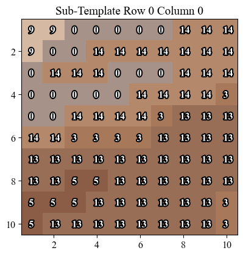
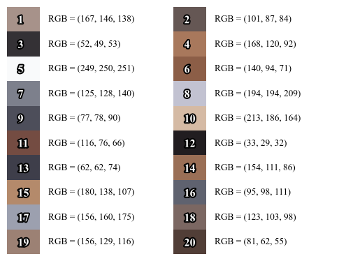

Copyright Ewan Short. All rights reserved.<br>

# Introduction
Happy 40th birthday Zoe! This repository contains a script for creating templates for tapestry and related crafts from a base image, for a specified number of colours, canvas mesh count and intended tapestry size. The script is based on the `scikit-learn` K-means colour quantisation [tutorial](https://scikit-learn.org/stable/auto_examples/cluster/plot_color_quantization.html). A minimum number of connected cells of the same colour can also be enforced.

As an example, this base image


becomes this 20 colour tapestry master template


for a tapestry 100 cells wide, where "2-connectivity" is enforced, i.e. where single cells of an isolated colour have been removed. Markers are shown every ten cells, and sub-templates generated for the boxes between markers. For example, the top left corner box is represented by the sub template below.

 

A swatch of the colours chosen is also generated, for easier matching with yarn.

 

# Installation
1. Click the green "Code" button above, then "Download ZIP" (or use `git clone`). Extract the ZIP file. You should end up with a folder called pytapestry.  
1. Download the [miniconda](https://docs.conda.io/en/latest/miniconda.html) installer. You most likely want the most recent, 64 bit version for your system. Run the installer. All the default installation settings are most likely fine.
1. Open the terminal (UNIX) or the Anaconda Powershell Prompt (Windows 10) and navigate to the pytapestry directory by typing `cd <base_dir>`, where `<base_dir>` is the full path to the pytapestry folder you extracted above. Into the terminal or prompt type

    ```
    conda env create -f pytapestry.yml
    ```

    to install scikit-image and scikit-learn into a python environment called pytapestry. Once created, you can activate your new pytapestry conda environment by typing
    ```
    conda activate pytapestry
    ```

# Running
1. Open the terminal (UNIX) or Anaconda Powershell Prompt (Windows 10).
1. Activate the conda environment by typing

    ```
    conda activate pytapestry
    ```

    This tells the shell to use the python environment defined above.
1. Run the following command in the terminal (UNIX) or Anaconda Powershell
Prompt (Windows 10) to run the pytapestry script,

    ```
    python <pytapestry_dir>/pytapestry.py <image_path>
    ```

    where `<pytapestry_dir>` is the full path to the pytapestry folder, and
    `<image_path>` is the full path to the image you want to create the tapestry template from.
1. To learn about optional arguments for specifying tapestry size, canvas mesh count, marker spacing, and cell connectivity,

    ```
    python <pytapestry_dir>/pytapestry.py -h
    ```
